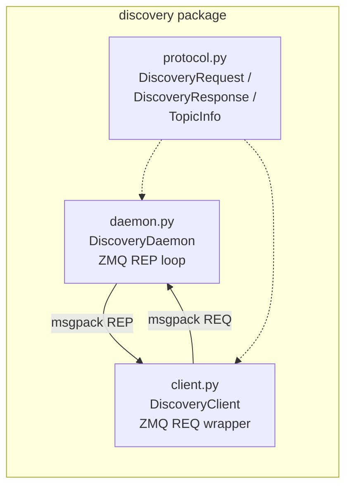
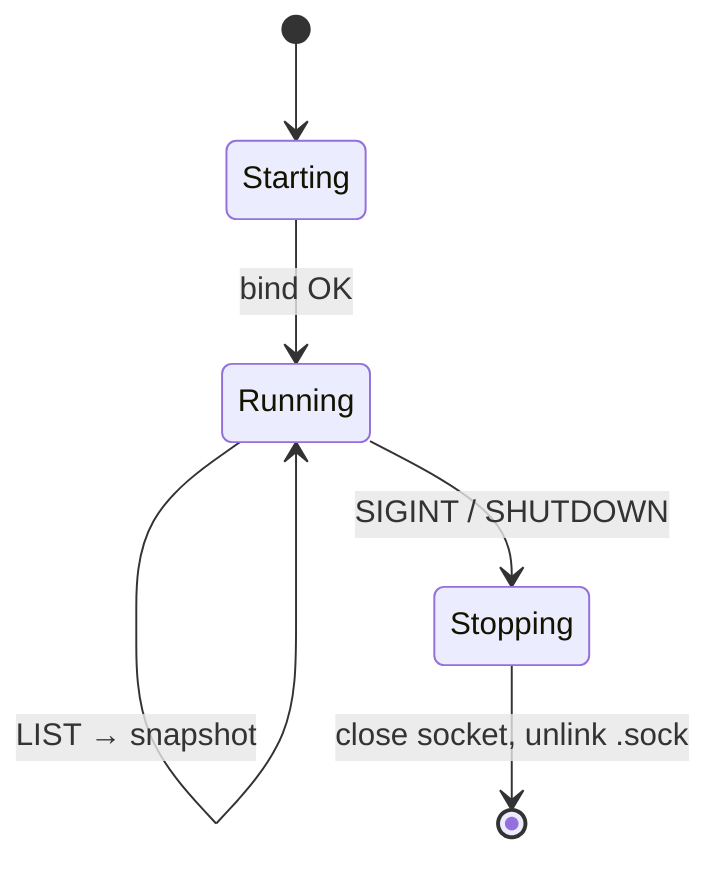
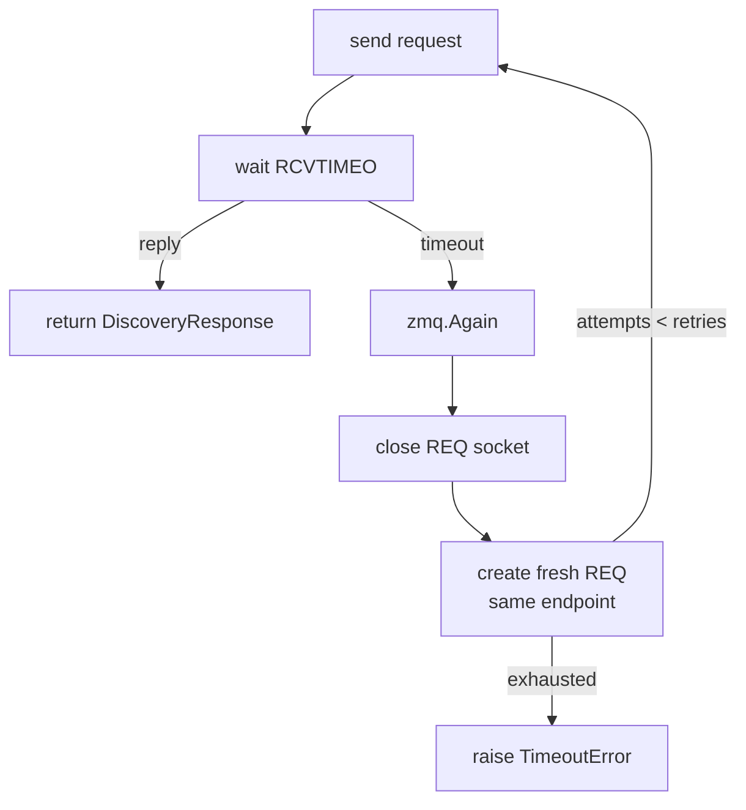

# Discovery

> **Source:** [`cortex.discovery.daemon`](../reference/discovery/daemon.md),
> [`cortex.discovery.client`](../reference/discovery/client.md),
> [`cortex.discovery.protocol`](../reference/discovery/protocol.md)

Discovery is Cortex's control plane: a single long-lived process that maps
topic names to ZMQ endpoints. It sits off the data path — once a subscriber
has an endpoint, messages flow publisher → subscriber directly without the
daemon's involvement.

## Moving parts

Everyone agrees on the wire format via `protocol.py`. The daemon runs a
single-threaded REP loop. The client speaks REQ from every publisher and
subscriber in the graph.

## Daemon

Implemented in [`DiscoveryDaemon`][cortex.discovery.daemon.DiscoveryDaemon].

Key behaviors:

- Binds `zmq.REP` at `ipc:///tmp/cortex/discovery.sock` by default.
- Maintains `_topics: dict[str, TopicInfo]` — **one publisher per topic**.
- `RCVTIMEO=1000` on the socket so the loop can check `_running` for clean
  Ctrl-C. This also means the daemon is naturally single-request-at-a-time —
  a slow client blocks all others.

### State transitions

### Registry semantics

| Case                                   | Result             |
| -------------------------------------- | ------------------ |
| New topic                              | Insert → OK         |
| Same topic, same `publisher_node`      | Overwrite → OK (re-registration) |
| Same topic, different `publisher_node` | Reject → ALREADY_EXISTS |
| UNREGISTER missing topic               | NOT_FOUND           |

## Client

Implemented in [`DiscoveryClient`][cortex.discovery.client.DiscoveryClient].

Thin REQ wrapper around the protocol. Important operational detail: **REQ
sockets stick after a timeout** — they block subsequent sends waiting for a
reply that never came. The client handles this by closing and recreating the
socket on every timeout (`_reconnect`). Callers don't see it.

### REQ timeout recovery

### Polling helpers

- [`lookup_topic(name)`][cortex.discovery.client.DiscoveryClient.lookup_topic] —
  one-shot, returns `None` on miss.
- [`wait_for_topic(name, timeout, poll_interval)`][cortex.discovery.client.DiscoveryClient.wait_for_topic] —
  blocking poll loop (time.sleep).
- [`wait_for_topic_async(name, timeout, poll_interval)`][cortex.discovery.client.DiscoveryClient.wait_for_topic_async] —
  async poll loop (asyncio.sleep). This is what [`Subscriber`][cortex.core.subscriber.Subscriber]
  uses when `wait_for_topic=True`.

## Protocol

Implemented in [`cortex.discovery.protocol`](../reference/discovery/protocol.md).

| Type                                                                 | Purpose                                   |
| -------------------------------------------------------------------- | ----------------------------------------- |
| [`DiscoveryCommand`][cortex.discovery.protocol.DiscoveryCommand]     | `REGISTER_TOPIC` / `UNREGISTER_TOPIC` / `LOOKUP_TOPIC` / `LIST_TOPICS` / `SHUTDOWN` |
| [`DiscoveryStatus`][cortex.discovery.protocol.DiscoveryStatus]       | `OK` / `NOT_FOUND` / `ALREADY_EXISTS` / `ERROR` |
| [`TopicInfo`][cortex.discovery.protocol.TopicInfo]                   | name, address, message_type, fingerprint, publisher_node |
| [`DiscoveryRequest`][cortex.discovery.protocol.DiscoveryRequest]     | command + optional topic_info / topic_name |
| [`DiscoveryResponse`][cortex.discovery.protocol.DiscoveryResponse]   | status, message, topic_info, topics        |

All payloads are msgpack. `TopicInfo` is nested as a packed sub-blob so
discovery responses stay flat.

## Known limitations

Summarized here, detailed in [critique.md](../critique.md):

- One-publisher-per-topic.
- No heartbeats or leases — crashed publishers leave stale entries.
- Single-threaded REP — slow client starves others.
- `retries=1` in the client is a fencepost; effective retries today is zero.
- Daemon state lost on restart; publishers do not auto-re-register.

## See also

- [Concepts → Discovery protocol](../concepts/discovery-protocol.md)
- [Getting started → Running the discovery daemon](../getting-started/discovery-daemon.md)
- [Critique](../critique.md)
