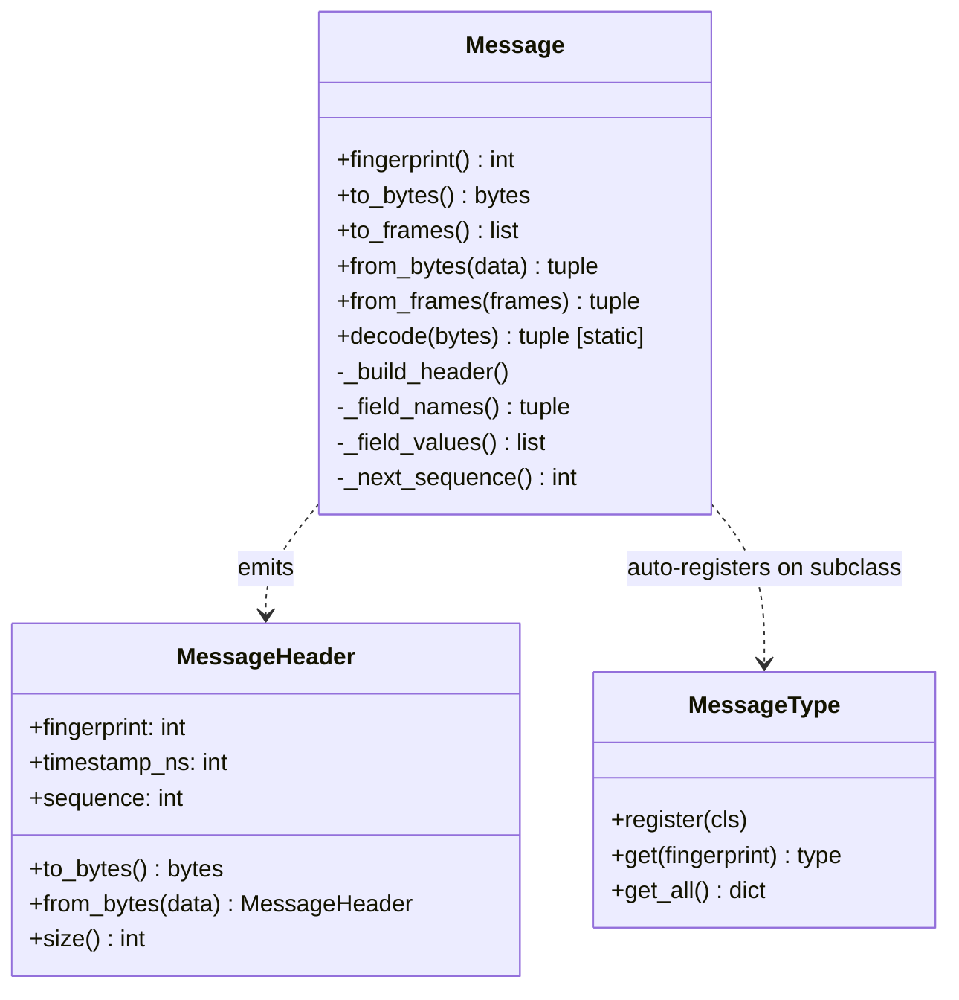
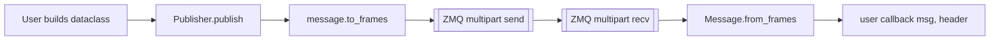

# Messages

> **Source:** [`cortex.messages.base`](../reference/messages/base.md),
> [`cortex.messages.standard`](../reference/messages/standard.md)

A message is a `@dataclass` that inherits from [`Message`][cortex.messages.base.Message]. Registration, fingerprinting, and serialization are automatic.

## Anatomy of a message



## Defining a custom message

```python
from dataclasses import dataclass
import numpy as np
from cortex.messages.base import Message

@dataclass
class JointTrajectory(Message):
    timestamp: float
    positions: np.ndarray   # shape (N,)
    velocities: np.ndarray  # shape (N,)
    frame_id: str = ""
```

The class registers into [`MessageType._registry`][cortex.messages.base.MessageType] by fingerprint at import time and gains:

- `JointTrajectory.fingerprint()` — 64-bit ID.
- `msg.to_frames()` / `JointTrajectory.from_frames(frames)` — transport path.
- `msg.to_bytes()` / `JointTrajectory.from_bytes(data)` — legacy single-blob path.
- `Message.decode(blob)` — class dispatch via fingerprint registry.

## Sequence numbering

Per-publisher monotonic counter, attached to each message's header. A class-level fallback counter on `Message._sequence_counter` covers direct `to_bytes`/`to_frames` use outside a Publisher (tests, ad-hoc serialization).

## Built-in messages

| Class                                                                     | Use for                                       |
| ------------------------------------------------------------------------- | --------------------------------------------- |
| [`StringMessage`][cortex.messages.standard.StringMessage]                 | Plain strings                                 |
| [`IntMessage`][cortex.messages.standard.IntMessage] / [`FloatMessage`][cortex.messages.standard.FloatMessage] | Single scalars                                |
| [`BytesMessage`][cortex.messages.standard.BytesMessage]                   | Opaque binary                                 |
| [`DictMessage`][cortex.messages.standard.DictMessage]                     | Nested dicts with arrays/tensors              |
| [`ListMessage`][cortex.messages.standard.ListMessage]                     | Mixed-type lists                              |
| [`ArrayMessage`][cortex.messages.standard.ArrayMessage]                   | Single NumPy array + name / frame_id          |
| [`MultiArrayMessage`][cortex.messages.standard.MultiArrayMessage]         | `dict[str, np.ndarray]` (e.g. points+colors)  |
| [`TensorMessage`][cortex.messages.standard.TensorMessage]                 | PyTorch tensor (preserves device/grad)        |
| [`MultiTensorMessage`][cortex.messages.standard.MultiTensorMessage]       | Named tensor bundle (model I/O)               |
| [`ImageMessage`][cortex.messages.standard.ImageMessage]                   | Image + encoding + width/height               |
| [`PointCloudMessage`][cortex.messages.standard.PointCloudMessage]         | XYZ + optional RGB / intensity / normals      |
| [`PoseMessage`][cortex.messages.standard.PoseMessage]                     | 6-DoF pose (position + quaternion)            |
| [`TransformMessage`][cortex.messages.standard.TransformMessage]           | 4×4 homogeneous transform                     |
| [`TimestampMessage`][cortex.messages.standard.TimestampMessage] / [`HeaderMessage`][cortex.messages.standard.HeaderMessage] | ROS-style stamps                              |

## Encode / decode lifecycle



## See also

- [Concept: message wire format](../concepts/message-wire-format.md)
- [Concept: fingerprinting](../concepts/fingerprinting.md)
- [Tutorial: custom messages](../tutorials/custom-messages.md)
