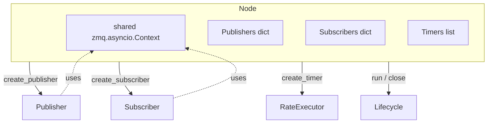
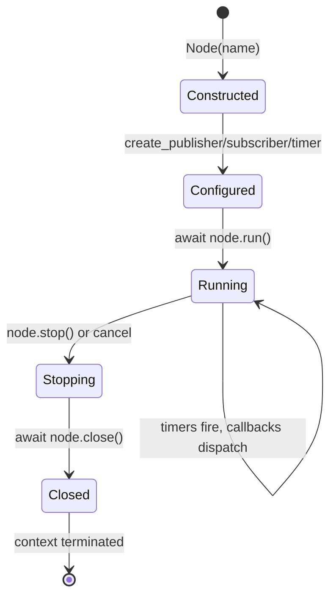
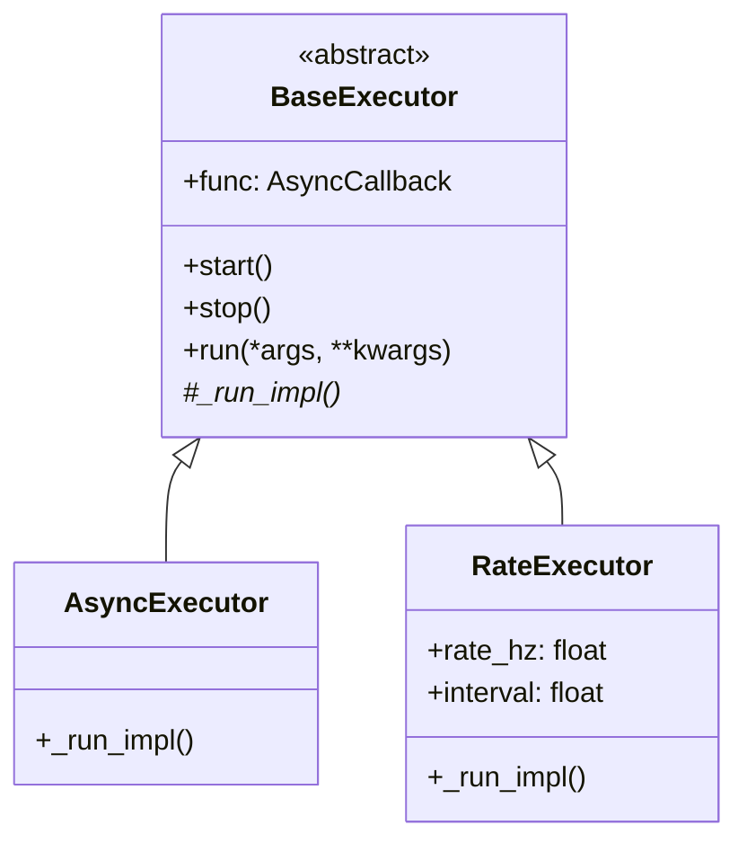
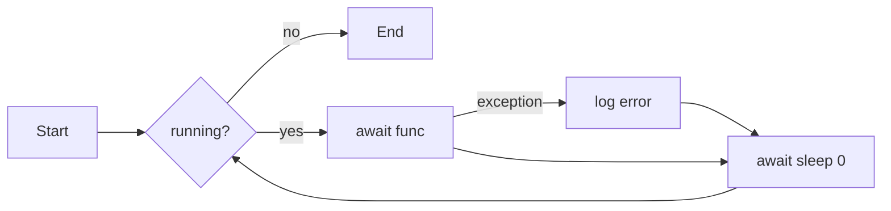
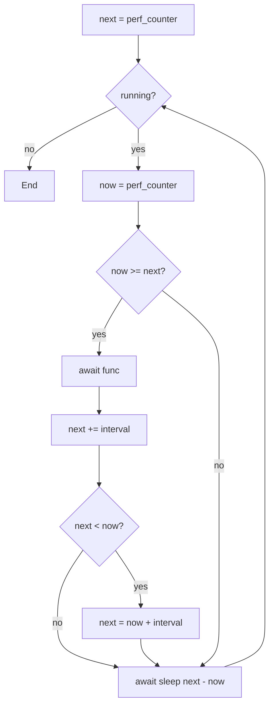

# Node & Executors

> **Source:** [`cortex.core.node`](../reference/core/node.md),
> [`cortex.core.executor`](../reference/core/executor.md)

A [`Node`][cortex.core.node.Node] is the user-facing composition unit: it owns
a shared ZMQ async context and a collection of publishers, subscribers, and
timers. Executors provide the scheduling primitives that timers and
subscriber receive loops run on.

## Responsibilities



One node = one process boundary in practice. Nothing stops you running
multiple nodes in the same process (`asyncio.gather([n.run() for n in nodes])`,
see [`examples/multi_node_system.py`](https://github.com/sudoRicheek/cortex/blob/main/examples/multi_node_system.py)),
but remember they share the same event loop — a slow callback in one still
blocks the others.

## Lifecycle



### `node.run()`

Spawns one asyncio task per timer and one per callback-bearing subscriber,
then `asyncio.gather`s them. Returns when all tasks complete or the node is
stopped.

```python
async with Node("my_node") as node:
    node.create_publisher("/x", IntMessage)
    node.create_subscriber("/y", IntMessage, callback=on_y)
    await node.run()   # blocks until cancelled
# __aexit__ calls close() automatically
```

### `node.close()`

Stops all executors, cancels outstanding tasks, closes every publisher and
subscriber (each of which unregisters/unbinds their own socket), and
terminates the shared ZMQ context. Idempotent.

## Executors

Two flavours, both subclasses of `BaseExecutor`.



### `AsyncExecutor`

"Run this coroutine as fast as possible, yielding between iterations."



Used by `Subscriber.run` to drive the receive-dispatch loop.

### `RateExecutor`

"Run this coroutine at a constant rate, catching up on overruns."



The catch-up branch silently drops ticks — if your 100 Hz callback takes
20 ms once, you do not get two callbacks back-to-back; you skip one tick.

!!! warning "Redundant yield"
    Today there is an `await asyncio.sleep(0)` inside the loop *and*
    `await asyncio.sleep(max(0, dt))` at the bottom. That generates an extra
    wakeup per tick. See [critique § 15](../critique.md).

## Timer usage

```python
node.create_timer(1.0 / 30, self.publish_frame)   # 30 Hz
node.create_timer(1.0, self.log_stats)            # 1 Hz
```

Timers are plain async functions — no decorator, no magic. They run in the
same event loop as subscriber callbacks, so the same head-of-line caveat
applies.

## Shared ZMQ context

Every publisher and subscriber created through a node **reuses** the node's
`zmq.asyncio.Context`. This means:

- Socket creation is cheap.
- io threads are shared across all sockets in the node.
- Terminating the node's context cleanly shuts down all its sockets.

Do not create your own context inside callbacks; you'll leak resources and
defeat the shared-io-thread optimization.

## Minimal complete node

```python
from dataclasses import dataclass
import numpy as np
import cortex
from cortex import Node, Message
from cortex.messages.base import MessageHeader


@dataclass
class Ping(Message):
    payload: np.ndarray
    counter: int


class Echo(Node):
    def __init__(self):
        super().__init__("echo")
        self.pub = self.create_publisher("/pong", Ping)
        self.create_subscriber("/ping", Ping, callback=self.on_ping)
        self._n = 0

    async def on_ping(self, msg: Ping, header: MessageHeader):
        self._n += 1
        self.pub.publish(Ping(payload=msg.payload, counter=self._n))


async def main():
    async with Echo() as node:
        await node.run()


if __name__ == "__main__":
    cortex.run(main())
```

## See also

- [`cortex.core.node`](../reference/core/node.md)
- [`cortex.core.executor`](../reference/core/executor.md)
- [Concepts → Async execution model](../concepts/async-execution-model.md)
- [Components → Publisher & Subscriber](publisher-subscriber.md)
