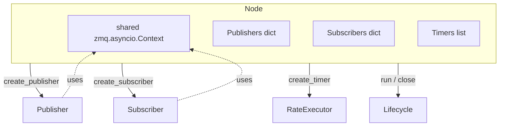
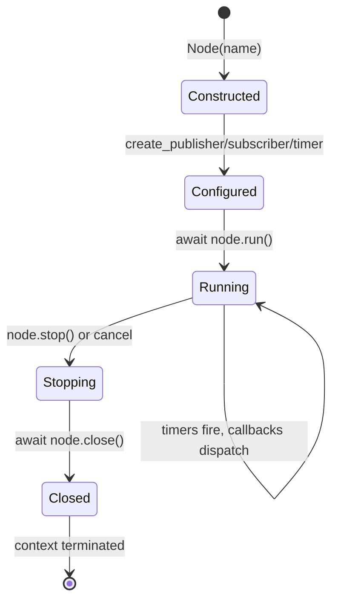
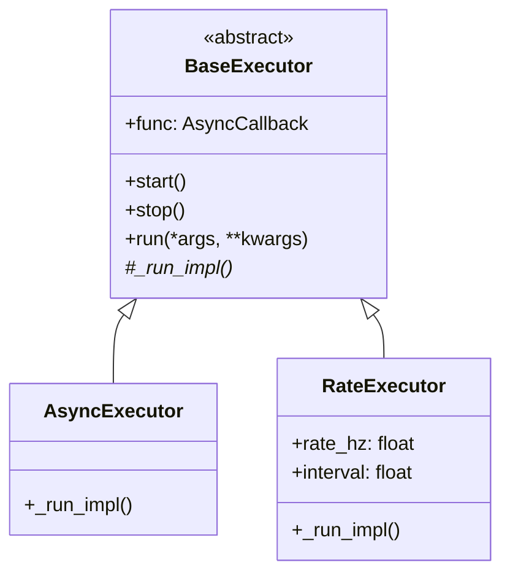
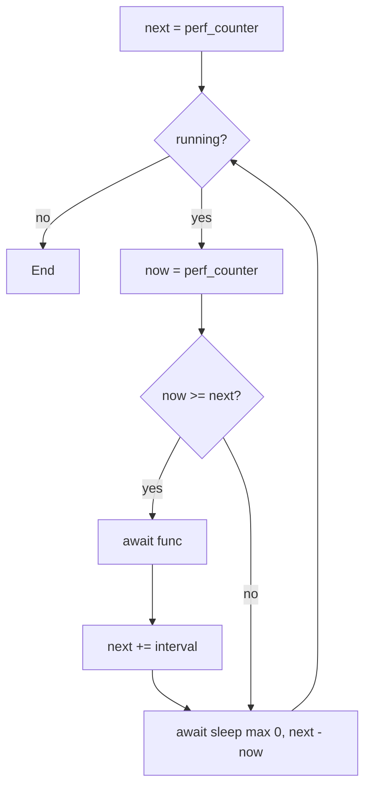

# Node & Executors

> **Source:** [`cortex.core.node`](../reference/core/node.md),
> [`cortex.core.executor`](../reference/core/executor.md)

A [`Node`][cortex.core.node.Node] owns a ZMQ async context, a set of publishers/subscribers, and a list of timers. Executors are the loops that drive timers and subscriber receive paths.

## Responsibilities



One node ≈ one process. You can run several in the same process via `asyncio.gather([n.run() for n in nodes])` ([`examples/multi_node_system.py`](https://github.com/sudoRicheek/cortex/blob/main/examples/multi_node_system.py)) — but they share the event loop, so a slow callback in one blocks the others.

## Lifecycle



`node.run()` spawns one asyncio task per timer and one per callback-bearing subscriber, then `asyncio.gather`s them.

`node.close()` stops executors, cancels tasks, closes all sockets, and terms the ZMQ context. Idempotent.

```python
async with Node("my_node") as node:
    node.create_publisher("/x", IntMessage)
    node.create_subscriber("/y", IntMessage, callback=on_y)
    await node.run()   # blocks until cancelled
# __aexit__ calls close() automatically
```

## Executors

Two subclasses of `BaseExecutor`:



### `AsyncExecutor`

Tight loop: `await func(); await asyncio.sleep(0)`. Used by `Subscriber.run` for receive-dispatch.

### `RateExecutor`

Fixed-grid timer at `rate_hz`. `next_exec_time` is initialized once, then advances by exactly one `interval` per callback invocation — never reset to "now."



**Missed ticks are not skipped.** If a 100 Hz callback overruns by 20 ms, the next two ticks fire back-to-back with zero-length sleeps until the clock catches up. The grid is preserved; no tick is silently dropped.

## Timer usage

```python
node.create_timer(1.0 / 30, self.publish_frame)   # 30 Hz async (default)
node.create_timer(1.0, self.log_stats)            # 1 Hz async
```

Plain async functions, no decorator. They share the event loop with subscriber callbacks — same head-of-line caveat.

### Sync timers for control loops

`mode='sync'` spawns a dedicated OS thread running [`SyncRateExecutor`][cortex.core.executor.SyncRateExecutor]. The callback is a plain function — no `async`/`await`, no event loop tax.

```python
def control_tick():
    pub.publish(WheelCommand(...))

node.create_timer(1.0 / 1000, control_tick, mode="sync")  # 1 kHz
```

## Shared ZMQ context

Every publisher/subscriber created through a node reuses the node's `zmq.asyncio.Context`. Socket creation is cheap, io threads are shared, terminating the context shuts everything down. Don't create your own context inside callbacks.

## Minimal complete node

```python
from dataclasses import dataclass
import numpy as np
import cortex
from cortex import Node, Message
from cortex.messages.base import MessageHeader


@dataclass
class Ping(Message):
    payload: np.ndarray
    counter: int


class Echo(Node):
    def __init__(self):
        super().__init__("echo")
        self.pub = self.create_publisher("/pong", Ping)
        self.create_subscriber("/ping", Ping, callback=self.on_ping)
        self._n = 0

    async def on_ping(self, msg: Ping, header: MessageHeader):
        self._n += 1
        self.pub.publish(Ping(payload=msg.payload, counter=self._n))


async def main():
    async with Echo() as node:
        await node.run()


if __name__ == "__main__":
    cortex.run(main())
```

## See also

- [`cortex.core.node`](../reference/core/node.md)
- [`cortex.core.executor`](../reference/core/executor.md)
- [Concepts → Async execution model](../concepts/async-execution-model.md)
- [Components → Publisher & Subscriber](publisher-subscriber.md)
