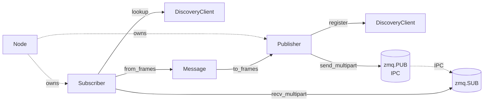
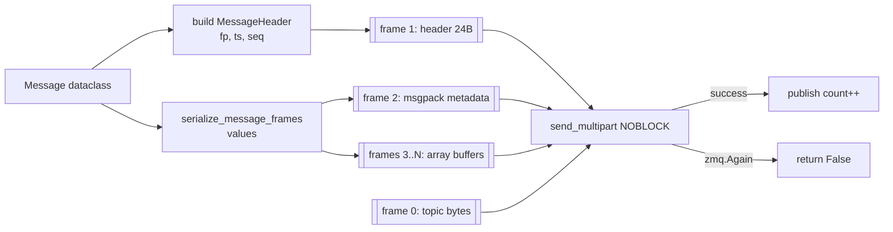
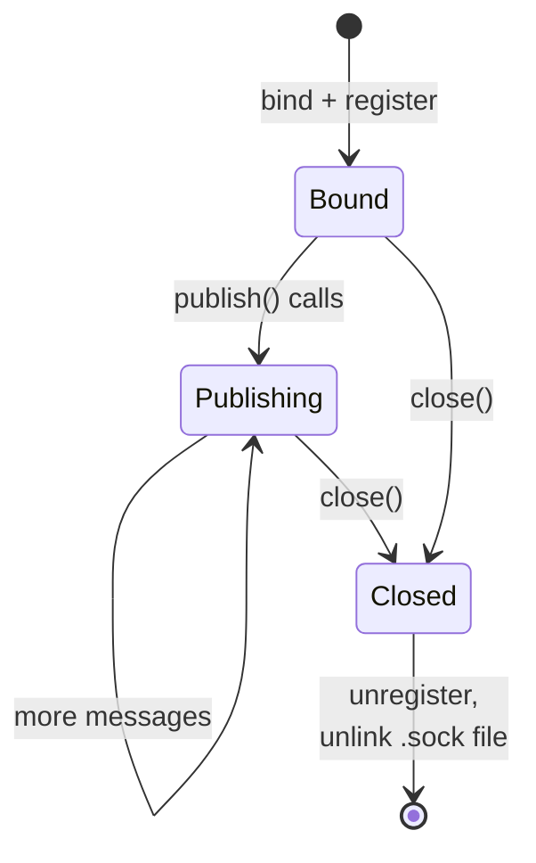
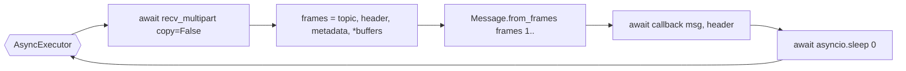

```mermaid
gantt
    title Receive loop when callback is slow
    dateFormat X
    axisFormat %L ms
    section Messages
    recv m1       :0, 1
    decode m1     :1, 2
    callback m1 (slow!) :active, 2, 50
    recv m2 (queued on HWM) :crit, 50, 51
    decode m2     :51, 52
    callback m2   :52, 55
```

# Publisher & Subscriber

> **Source:** [`cortex.core.publisher`](../reference/core/publisher.md),
> [`cortex.core.subscriber`](../reference/core/subscriber.md)

The data-plane workhorses. A `Publisher` binds a ZMQ `PUB` socket and registers
with discovery; a `Subscriber` looks up the endpoint, connects a `SUB` socket,
and drives an async receive loop. Discovery is consulted **once per topic** on
startup — it is not on the hot path.

## Relationship to the rest of the stack



## Publisher

### Construction

Always create via [`Node.create_publisher`][cortex.core.node.Node.create_publisher] —
direct construction works but skips the shared ZMQ context reuse and the
node-level registration bookkeeping.

```python
pub = node.create_publisher(
    topic_name="/camera/image",   # must start with "/"
    message_type=ImageMessage,    # fingerprint is taken from this class
    queue_size=100,               # SNDHWM; drops under backpressure
)
```

### Startup sequence

```mermaid
sequenceDiagram
    autonumber
    participant U as User
    participant Pub as Publisher
    participant FS as /tmp/cortex/topics/
    participant ZMQ as zmq.PUB
    participant D as Discovery daemon

    U->>Pub: __init__(topic, msg_cls, ...)
    Pub->>Pub: address = generate_ipc_address(topic, node)
    Pub->>FS: mkdir -p; unlink stale .sock
    Pub->>ZMQ: socket(PUB); setsockopt HWM/LINGER; bind(address)
    Pub->>D: REGISTER TopicInfo{name, address, fingerprint, node}
    D-->>Pub: OK / ALREADY_EXISTS
    Note over Pub: ready; user can publish()
```

Two things worth calling out:

1. The IPC address is derived deterministically from `node_name` and
   `topic_name` via [`generate_ipc_address`][cortex.core.publisher.generate_ipc_address]:
   `ipc:///tmp/cortex/topics/<node>__<topic-with-slashes-as-underscores>.sock`.
2. `_setup_socket` unlinks any existing file at that path before binding. That
   protects against crash-leftover sockets, but also means **two publishers
   configured with the same `node_name + topic_name` in the same process tree
   will silently stomp each other** — see [critique § 10](../critique.md).

### Publish path



`publish()` is **synchronous** and returns a boolean:

- `True` — handed to ZMQ successfully.
- `False` — `zmq.Again`, queue full, message dropped.

Any other exception is logged and swallowed; `publish` still returns `False`.
For robotics code this "fire and forget" is intentional — the caller decides
whether to retry based on the return value and the topic's role.

### Async context quirk

`Node` owns a `zmq.asyncio.Context`. The `Publisher` constructor detects this
and wraps a **sync** `zmq.Context` around the same underlying io threads:

```python
if isinstance(self._context, zmq.asyncio.Context):
    self._context: zmq.Context = zmq.Context(self._context)
```

This keeps `publish()` a normal function call instead of forcing every publish
to be `await`ed. It is the right performance choice, but it has consequences:

!!! danger "`zmq.PUB` is not thread-safe"
    Do not call `publish()` on the same `Publisher` from multiple threads
    (or multiple asyncio tasks that could race on `send_multipart`). Serialize
    per-publisher calls yourself if you fan out work.

### Lifecycle and cleanup



`Publisher.close()` is best-effort: it unregisters from the daemon (silently
tolerates a dead daemon), closes the socket, and removes the IPC file.
Exceptions from any one step do not block the others.

### Statistics

`publisher.publish_count`, `publisher.last_publish_time`, and
`publisher.is_registered` are exposed for instrumentation. They update on the
hot path with no locking — read them from the same task that calls `publish()`
for deterministic numbers.

## Subscriber

### Construction

```python
sub = node.create_subscriber(
    topic_name="/camera/image",
    message_type=ImageMessage,
    callback=on_image,          # async def callback(msg, header)
    queue_size=10,              # RCVHWM
    wait_for_topic=True,        # poll until topic appears
    topic_timeout=30.0,         # abort wait after N seconds
)
```

If `callback` is `None`, the subscriber is passive — call `await sub.receive()`
manually. With a callback, `Node.run()` will drive the receive loop.

### Startup sequence

```mermaid
sequenceDiagram
    autonumber
    participant U as User
    participant S as Subscriber
    participant D as DiscoveryClient
    participant Pub as publisher IPC

    U->>S: __init__(...)
    S->>D: lookup_topic(name)  # non-blocking
    alt found immediately
        D-->>S: TopicInfo
        S->>S: verify fingerprint
        S->>Pub: SUB connect + SUBSCRIBE topic
        Note over S: is_connected = True
    else not found
        D-->>S: None
        Note over S: defer; retry in run()
    end

    U->>S: node.run() schedules sub.run()
    S->>D: wait_for_topic_async(name, timeout)
    D-->>S: TopicInfo
    S->>Pub: SUB connect + SUBSCRIBE topic
```

The constructor tries a non-blocking lookup first so that when a publisher is
already up, no polling is needed. The polling fallback only kicks in inside
`sub.run()` via [`wait_for_topic_async`][cortex.discovery.client.DiscoveryClient.wait_for_topic_async].

### Receive loop



- `copy=False` means each frame is a `zmq.Frame` — the metadata and array
  buffers are memoryview-able without a copy. See
  [`cortex.utils.serialization`](../reference/utils/serialization.md).
- The one-frame fast path (`len(payload_frames) == 1`) handles legacy
  publishers still on the single-blob path — it falls back to
  `from_bytes` on the single payload buffer.

### Head-of-line blocking

The callback runs **inline** in the receive loop. A slow callback stalls
everything:



If callbacks do meaningful work, dispatch them to a task or thread pool:

```python
import asyncio

async def on_image(msg, header):
    asyncio.create_task(process_in_background(msg, header))
```

Or use a bounded queue + worker pattern. The roadmap item in
[critique § 6](../critique.md) is to lift this into the framework.

### Fingerprint verification

On connect the subscriber compares its class's fingerprint to the one in the
registry entry. Today a mismatch only logs a warning and **proceeds anyway** —
downstream decoding will then fail hard. Treat fingerprint warnings as errors
in your code.

### Cleanup

`Subscriber.close()` stops the executor, closes the discovery client and SUB
socket, and flips `is_connected` to `False`. Safe to call multiple times;
errors are suppressed so teardown does not cascade.

## Statistics and instrumentation

| Property                                 | Publisher | Subscriber |
| ---------------------------------------- | --------- | ---------- |
| `publish_count` / `receive_count`        | ✓         | ✓          |
| `last_publish_time` / `last_receive_time`| ✓         | ✓          |
| `is_registered` / `is_connected`         | ✓         | ✓          |
| `topic_info`                             |           | ✓          |

None of these are atomic; treat them as coarse gauges.

## Common pitfalls

| Symptom                                    | Cause                                                                                      | Fix                                      |
| ------------------------------------------ | ------------------------------------------------------------------------------------------ | ---------------------------------------- |
| First N messages not received              | ZMQ "slow joiner": SUB not connected yet when PUB started publishing                       | Let subscriber start first, or sleep briefly before first publish |
| Subscriber receives nothing, no errors     | Topic name mismatch, or forgot to call `node.run()`                                        | Log both sides; run `cortex-discovery --log-level DEBUG` |
| `publish()` returns `False` repeatedly     | Subscriber can't keep up; SNDHWM reached                                                   | Increase `queue_size`, or reduce publish rate |
| Mutating a received array "corrupts" later | Decoded arrays alias ZMQ frame memory                                                      | `arr = arr.copy()` before mutating        |
| Two processes stomp each other's socket    | Same `node_name + topic_name`                                                              | Unique node names per process             |

## See also

- [`cortex.core.publisher`](../reference/core/publisher.md)
- [`cortex.core.subscriber`](../reference/core/subscriber.md)
- [Concepts → Async execution model](../concepts/async-execution-model.md)
- [Concepts → Message wire format](../concepts/message-wire-format.md)
- [Guides → Debugging](../guides/debugging.md)
