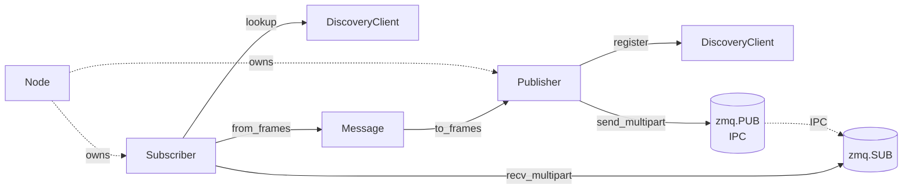
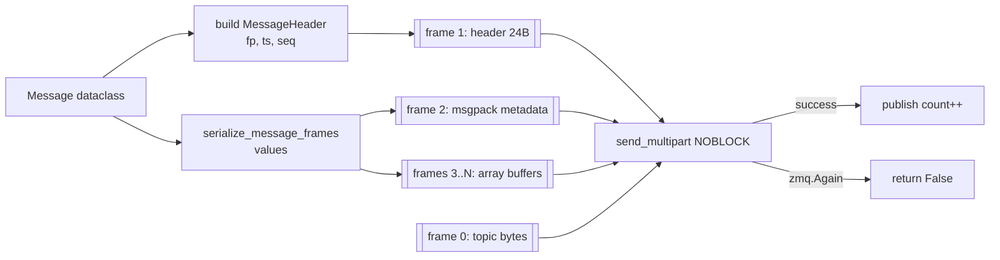
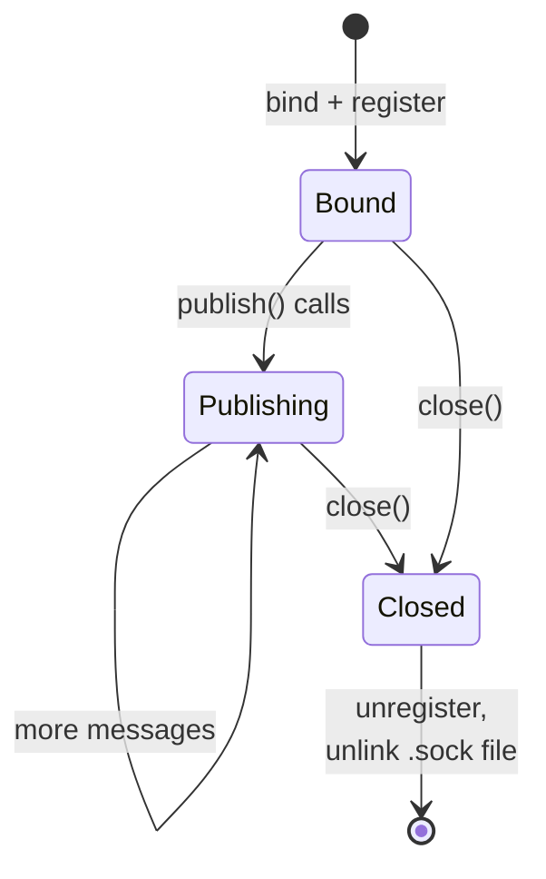
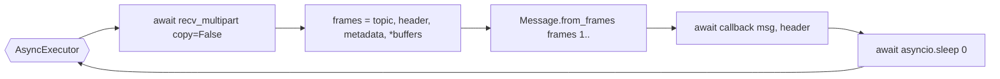

# Publisher & Subscriber

> **Source:** [`cortex.core.publisher`](../reference/core/publisher.md),
> [`cortex.core.subscriber`](../reference/core/subscriber.md)

A `Publisher` binds a ZMQ `PUB` socket and registers with discovery. A `Subscriber` looks up the endpoint, connects a `SUB` socket, and drives an async receive loop. Discovery is consulted once per topic on startup; it's not on the hot path.

## Relationship to the rest of the stack



## Publisher

### Construction

Always create via [`Node.create_publisher`][cortex.core.node.Node.create_publisher]. Direct construction works but skips the shared ZMQ context and node-level bookkeeping.

```python
pub = node.create_publisher(
    topic_name="/camera/image",   # must start with "/"
    message_type=ImageMessage,    # fingerprint is taken from this class
    queue_size=100,               # SNDHWM; drops under backpressure
)
```

### Startup sequence

```mermaid
sequenceDiagram
    autonumber
    participant U as User
    participant Pub as Publisher
    participant FS as /tmp/cortex/topics/
    participant ZMQ as zmq.PUB
    participant D as Discovery daemon

    U->>Pub: __init__(topic, msg_cls, ...)
    Pub->>Pub: address = generate_ipc_address(topic, node)
    Pub->>FS: mkdir -p; unlink stale .sock
    Pub->>ZMQ: socket(PUB); setsockopt HWM/LINGER; bind(address)
    Pub->>D: REGISTER TopicInfo{name, address, fingerprint, node}
    D-->>Pub: OK / ALREADY_EXISTS
    Note over Pub: ready; user can publish()
```

Two notes:

1. The IPC address is derived from `node_name + topic_name` via [`generate_ipc_address`][cortex.core.publisher.generate_ipc_address]: `ipc:///tmp/cortex/topics/<node>__<topic-with-slashes-as-underscores>.sock`.
2. `_setup_socket` unlinks any existing file at that path before binding. That cleans up crash-leftover sockets — but two publishers with the same `node_name + topic_name` silently stomp each other.

### Publish path



`publish()` is synchronous and returns a `bool`:

- `True` — handed to ZMQ successfully.
- `False` — `zmq.Again` (queue full, message dropped) or any other exception (logged, swallowed).

Fire-and-forget. The caller decides whether to retry based on the return value and the topic's role.

### Async context quirk

`Node` owns a `zmq.asyncio.Context`. The `Publisher` constructor detects this and wraps a sync `zmq.Context` around the same underlying io threads:

```python
if isinstance(self._context, zmq.asyncio.Context):
    self._context: zmq.Context = zmq.Context(self._context)
```

This keeps `publish()` a plain function call. Performance win, with one consequence:

!!! danger "`zmq.PUB` is not thread-safe"
    Don't call `publish()` on the same `Publisher` from multiple threads or from tasks that race on `send_multipart`. Serialize per-publisher calls yourself if you fan out work.

### Lifecycle and cleanup



`Publisher.close()` unregisters from the daemon (tolerates a dead daemon), closes the socket, and removes the IPC file. Exceptions in any step don't block the others.

### Statistics

`publish_count`, `last_publish_time`, `is_registered` are exposed for instrumentation. Updated on the hot path with no locking — read them from the same task that calls `publish()` for deterministic numbers.

## Subscriber

### Construction

```python
sub = node.create_subscriber(
    topic_name="/camera/image",
    message_type=ImageMessage,
    callback=on_image,          # async def callback(msg, header)
    queue_size=10,              # RCVHWM
    wait_for_topic=True,        # poll until topic appears
    topic_timeout=30.0,         # abort wait after N seconds
)
```

If `callback` is `None`, the subscriber is passive — call `await sub.receive()` manually. With a callback, `Node.run()` drives the receive loop.

### Startup sequence

```mermaid
sequenceDiagram
    autonumber
    participant U as User
    participant S as Subscriber
    participant D as DiscoveryClient
    participant Pub as publisher IPC

    U->>S: __init__(...)
    S->>D: lookup_topic(name)  # non-blocking
    alt found immediately
        D-->>S: TopicInfo
        S->>S: verify fingerprint
        S->>Pub: SUB connect + SUBSCRIBE topic
        Note over S: is_connected = True
    else not found
        D-->>S: None
        Note over S: defer; retry in run()
    end

    U->>S: node.run() schedules sub.run()
    S->>D: wait_for_topic_async(name, timeout)
    D-->>S: TopicInfo
    S->>Pub: SUB connect + SUBSCRIBE topic
```

The constructor tries a non-blocking lookup first. If the publisher is already up, no polling is needed. Otherwise the polling fallback runs inside `sub.run()` via [`wait_for_topic_async`][cortex.discovery.client.DiscoveryClient.wait_for_topic_async].

### Receive loop



- `copy=False` makes each frame a `zmq.Frame` — metadata and array buffers are memoryview-able without copying. See [`cortex.utils.serialization`](../reference/utils/serialization.md).
- The one-frame fast path (`len(payload_frames) == 1`) handles legacy publishers on the single-blob path — falls back to `from_bytes`.

### Head-of-line blocking

The callback runs inline in the receive loop. A slow callback stalls it:

```mermaid
gantt
    title Receive loop when callback is slow
    dateFormat X
    axisFormat %L ms
    section Messages
    recv m1       :0, 1
    decode m1     :1, 2
    callback m1 (slow!) :active, 2, 50
    recv m2 (queued on HWM) :crit, 50, 51
    decode m2     :51, 52
    callback m2   :52, 55
```



If callbacks do real work, dispatch them to a task or thread pool:

```python
import asyncio

async def on_image(msg, header):
    asyncio.create_task(process_in_background(msg, header))
```

Or use a bounded queue + worker pattern of your own.

### Fingerprint verification

On connect the subscriber compares its class's fingerprint to the registry entry. In async mode, mismatch logs a warning and continues (downstream decode will fail loudly). For strict behavior pass `strict_fingerprint=True`, or use `mode='sync'` (always strict).

### Cleanup

`Subscriber.close()` stops the executor, closes the discovery client and SUB socket, and flips `is_connected` to `False`. Idempotent; errors are suppressed so teardown doesn't cascade.

## See also

- [`cortex.core.publisher`](../reference/core/publisher.md)
- [`cortex.core.subscriber`](../reference/core/subscriber.md)
- [Concepts → Async execution model](../concepts/async-execution-model.md)
- [Concepts → Message wire format](../concepts/message-wire-format.md)
- [Guides → Debugging](../guides/debugging.md)
