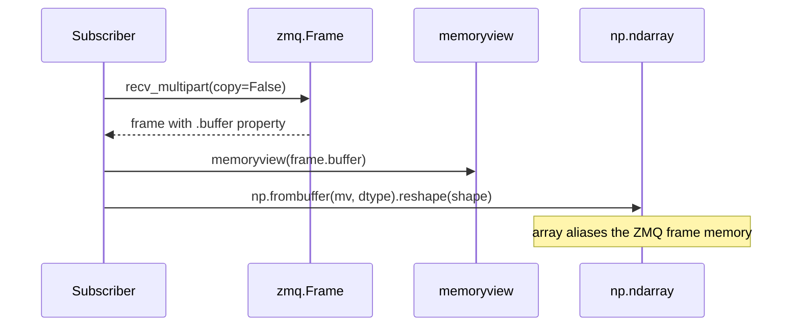

# Serialization

> **Source:** [`cortex.utils.serialization`](../reference/utils/serialization.md),
> [`cortex.utils.hashing`](../reference/utils/hashing.md)

Two encodings:

- **Multipart / OOB** — what the transport uses. Arrays ride as separate frames.
- **Single-blob** — legacy `Message.to_bytes` / `decode`, used by tests and persistence.

Both support the same Python types; only the frame layout differs.

## Supported types

| Type                          | Inline path (`to_bytes`)      | OOB path (`to_frames`)        |
| ----------------------------- | ----------------------------- | ----------------------------- |
| `None`                        | 1 byte tag                    | msgpack `nil`                 |
| `int`, `float`, `str`, `bool` | msgpack PRIMITIVE             | msgpack                       |
| `bytes`                       | tag + length + bytes          | msgpack bin                   |
| `list`, `tuple`, `dict`       | msgpack with ExtType arrays   | msgpack with OOB descriptors  |
| `np.ndarray`                  | ExtType (inline bytes)        | OOB descriptor + extra frame  |
| `torch.Tensor`                | ExtType (inline bytes)        | OOB descriptor + extra frame  |

## The two paths, side by side

=== "OOB multipart (used on the wire)"

    ```mermaid
    flowchart LR
        V[values] --> E[_encode_transport_value]
        E --> Meta[msgpack metadata<br/>OOB descriptors for arrays]
        E --> Bufs[[buffer 0]]
        E --> Bufs2[[buffer 1]]
        Meta --> Out[(list of frames)]
        Bufs --> Out
        Bufs2 --> Out
    ```

    Entry point: [`serialize_message_frames`][cortex.utils.serialization.serialize_message_frames]:

    ```python
    metadata_bytes, [buf0, buf1, ...] = serialize_message_frames(values)
    ```

    Arrays stay contiguous; ZMQ hands the buffer straight to the kernel.

=== "Inline blob (legacy / `Message.decode`)"

    ```mermaid
    flowchart LR
        V[values] --> P[msgpack.packb<br/>default=_msgpack_default]
        P --> Ext[ExtType 1/2 for arrays/tensors<br/>bytes embedded]
        Ext --> Blob[single bytes blob]
    ```

    `serialize(value)` → `deserialize(data)`. Useful for persistence or any self-contained payload without extra buffers.

## OOB descriptors

A small dict that takes the place of the array inside the msgpack metadata:

```python
# numpy
{"__cortex_oob__": "numpy", "buffer": 0, "dtype": "<f4", "shape": [480, 640, 3]}

# torch
{"__cortex_oob__": "torch", "buffer": 1, "dtype": "<f4",
 "shape": [1, 3, 224, 224], "device": "cuda:0", "requires_grad": True}
```

`buffer` is the index into the ZMQ frames after the metadata. Nested structures (dict of arrays, list of tensors) are walked recursively by `_encode_transport_value` / `_decode_transport_value`.

## Zero-copy on the decode side



!!! warning "Aliasing caveat"
    The returned NumPy array is a view over the ZMQ frame buffer. Safe to read while the frame lives (at least until your callback returns). If you need to mutate or keep it past the callback, `arr = arr.copy()` first.

## PyTorch specifics

- Tensors are always moved to CPU for transport.
- On decode, CUDA tensors are moved back to the original device if CUDA is available; otherwise they stay on CPU.
- `requires_grad` is preserved.

## Fingerprinting

[`compute_fingerprint(cls)`][cortex.utils.hashing.compute_fingerprint] computes a 64-bit identity from module path, class name, and sorted `field:type` pairs. Cached per-class. Full story: [Concepts → Fingerprinting](../concepts/fingerprinting.md).

## When to use each helper

| Helper                                                                                            | Use when                                                   |
| ------------------------------------------------------------------------------------------------- | ---------------------------------------------------------- |
| [`serialize_message_frames`][cortex.utils.serialization.serialize_message_frames]                 | You're building a custom transport that speaks multipart   |
| [`deserialize_message_frames`][cortex.utils.serialization.deserialize_message_frames]             | Decoding the above                                         |
| [`serialize(value)`][cortex.utils.serialization.serialize] / [`deserialize`][cortex.utils.serialization.deserialize] | Persisting a single value to disk / cache                  |
| [`serialize_numpy`][cortex.utils.serialization.serialize_numpy] / [`deserialize_numpy`][cortex.utils.serialization.deserialize_numpy] | Raw array round-trip without msgpack overhead              |
| `Message.to_frames` / `Message.from_frames`                                                        | Anything inside Cortex itself                              |

## See also

- [Concepts → Message wire format](../concepts/message-wire-format.md)
- [Concepts → Fingerprinting](../concepts/fingerprinting.md)
- [Guides → Performance tuning](../guides/performance-tuning.md)
