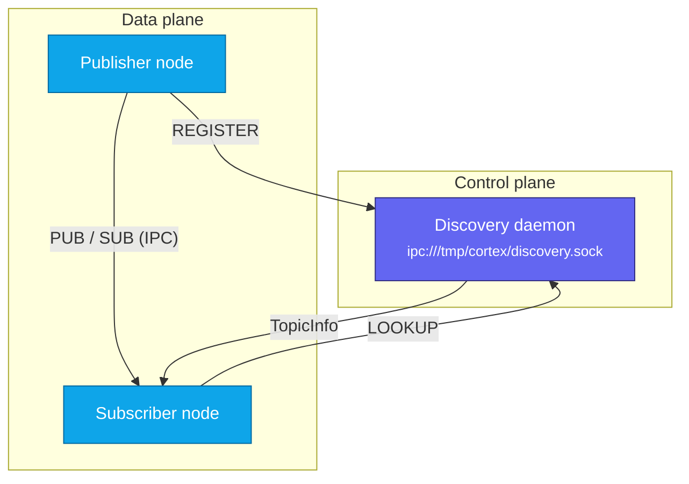
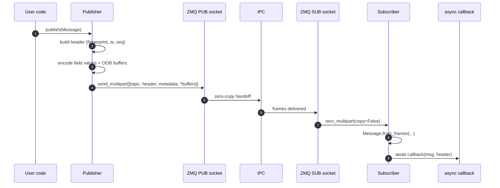
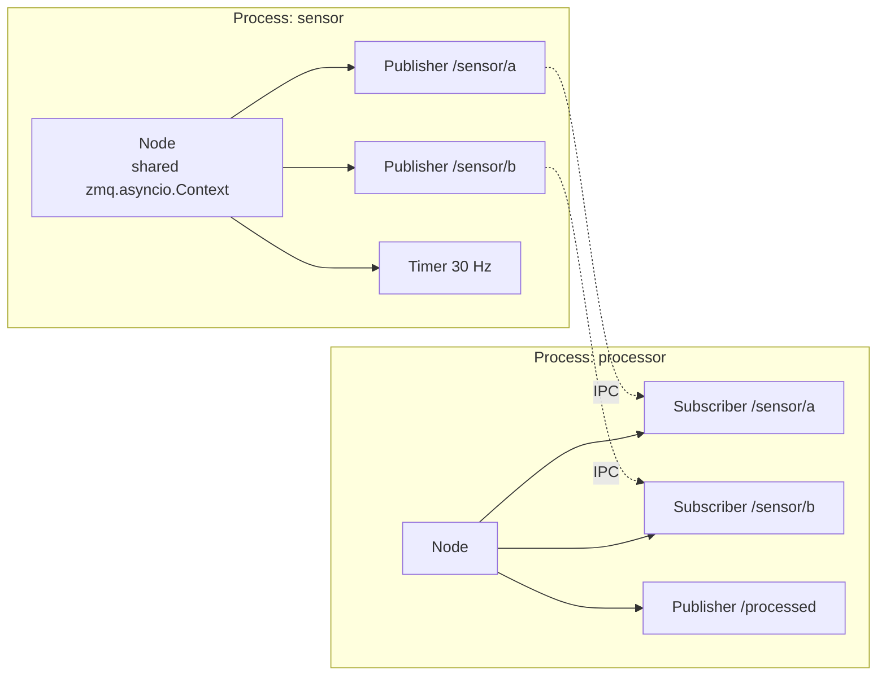

# Architecture

Cortex has three moving parts: the **discovery daemon**, **publisher** nodes,
and **subscriber** nodes. They coordinate over ZeroMQ — a REQ/REP control plane
for discovery and a PUB/SUB data plane for messages.

## High-level view

## Message journey

Tracing one frame end to end:

Key invariant: array buffers ride as **separate ZMQ frames**, not inline in the
metadata. See [Message wire format](message-wire-format.md).

## Process layout

Each topic gets its own IPC socket under `/tmp/cortex/topics/`. A single `Node`
shares one `zmq.asyncio.Context` across all its publishers and subscribers to
avoid per-socket io thread overhead.

## See also

- [Message wire format](message-wire-format.md)
- [Fingerprinting](fingerprinting.md)
- [Discovery protocol](discovery-protocol.md)
- [Async execution model](async-execution-model.md)
