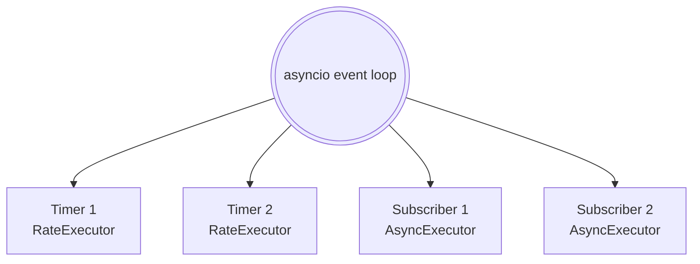
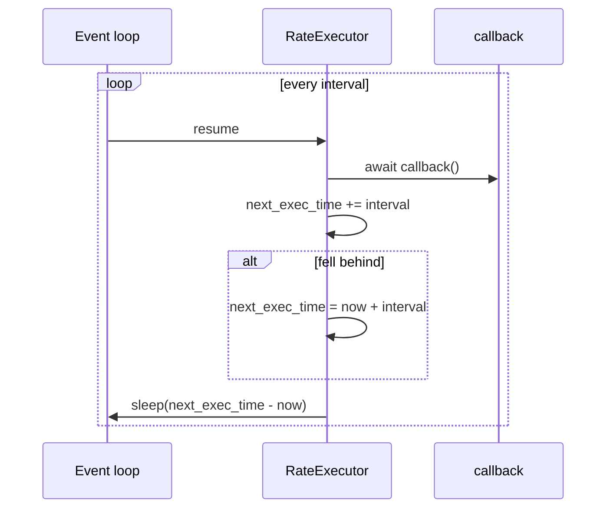
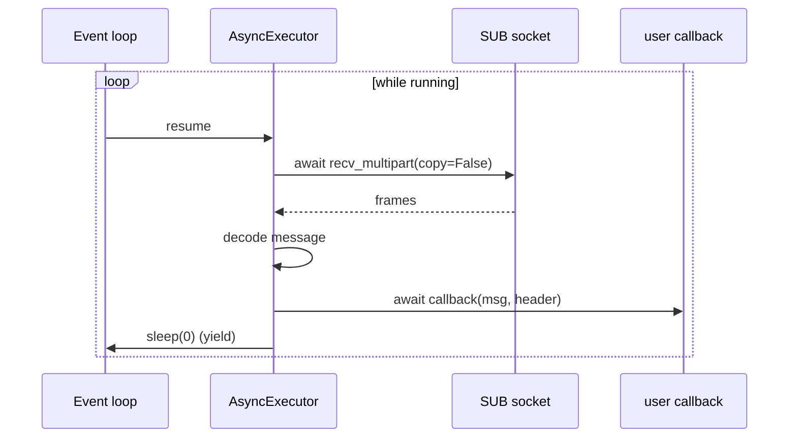

# Async execution model

Cortex nodes are asyncio-native. One event loop per process drives all
publishers, subscribers, and timers for that node. On Linux and macOS,
[`cortex.run`][cortex.utils.loop.run] prefers `uvloop` for lower tail latency.

## Node task graph

`Node.run()` spawns one task per timer (`RateExecutor`) and one per
callback-bearing subscriber (`AsyncExecutor`). It then `asyncio.gather`s them
until cancelled.

## `RateExecutor` cadence

Catch-up logic **silently drops ticks** when a callback overruns its period —
something to keep in mind for control loops.

## `AsyncExecutor` receive loop

!!! warning "Head-of-line blocking"
    A slow callback stalls the receive loop. Messages pile up on the SUB HWM
    and get evicted. If you expect variable-latency work, offload callback
    bodies to `asyncio.create_task(...)` or a thread pool.

## Publish is sync-inside-async

The `Publisher` uses a sync `zmq.Context` (shadowed onto the node's async
context). `publish()` is a plain function call — no `await`. This avoids the
overhead of the async zmq integration on the send path.

!!! danger "Not thread-safe"
    A `zmq.PUB` socket is not safe to call from multiple threads or tasks
    concurrently. Serialize calls to `publish()` per publisher.

## uvloop

On Unix, importing `cortex.run` checks for `uvloop` and uses it if present.
Measured impact: modest throughput improvement, meaningful p99 latency
reduction on high-rate small messages.

## See also

- [`cortex.core.executor`](../reference/core/executor.md)
- [`cortex.core.node`](../reference/core/node.md)
- [Components → Node & Executors](../components/node-and-executors.md)
