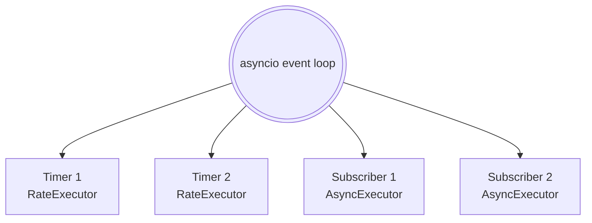
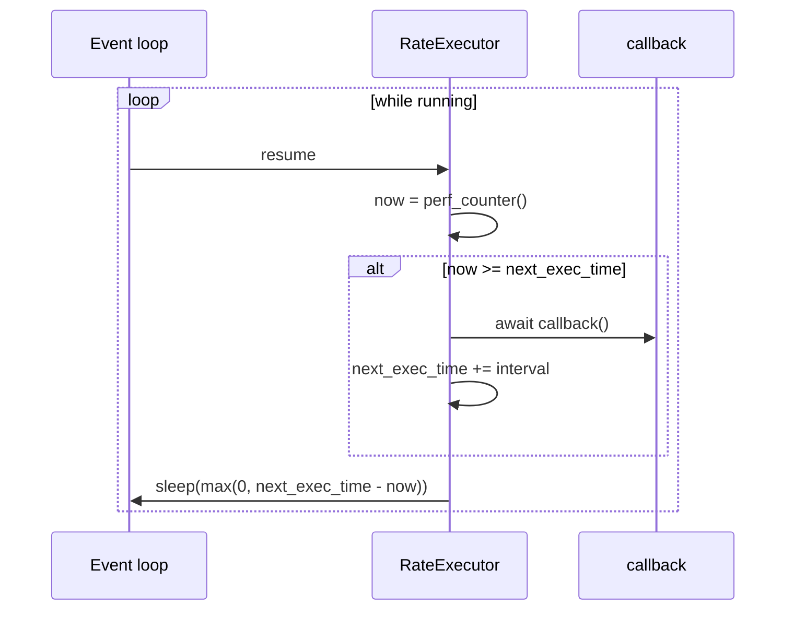
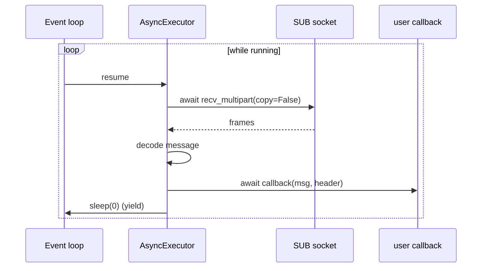

# Async execution model

Cortex nodes are asyncio-native: one event loop per process drives all publishers, subscribers, and timers for that node. On Linux/macOS, [`cortex.run`][cortex.utils.loop.run] uses `uvloop` when available.

## Node task graph

`Node.run()` spawns one task per timer (`RateExecutor`) and one per callback-bearing subscriber (`AsyncExecutor`), then `asyncio.gather`s them until cancelled.

## `RateExecutor` cadence

`next_exec_time` is set once at start and advances by exactly one `interval` per callback fire. If a callback overruns, the next sleep is zero-length until the clock catches up — **ticks are never skipped**, they fire back-to-back until aligned with the grid.

## `AsyncExecutor` receive loop

!!! warning "Head-of-line blocking"
    A slow callback stalls the receive loop. Messages pile up on the SUB HWM and get evicted. Offload variable-latency work to `asyncio.create_task(...)` or a thread pool.

## Publish is sync-inside-async

`Publisher` holds a plain `zmq.Context` (shadowed onto the node's async context). `publish()` is a regular function call — no `await` — to skip the async zmq send overhead.

!!! danger "Not thread-safe"
    `zmq.PUB` sockets are not safe to call from multiple threads or tasks concurrently. Serialize calls to `publish()` per publisher.

## uvloop

On Unix, `cortex.run` uses `uvloop` if it's installed. Lower p99 latency on high-rate small messages.

## See also

- [`cortex.core.executor`](../reference/core/executor.md)
- [`cortex.core.node`](../reference/core/node.md)
- [Components → Node & Executors](../components/node-and-executors.md)
