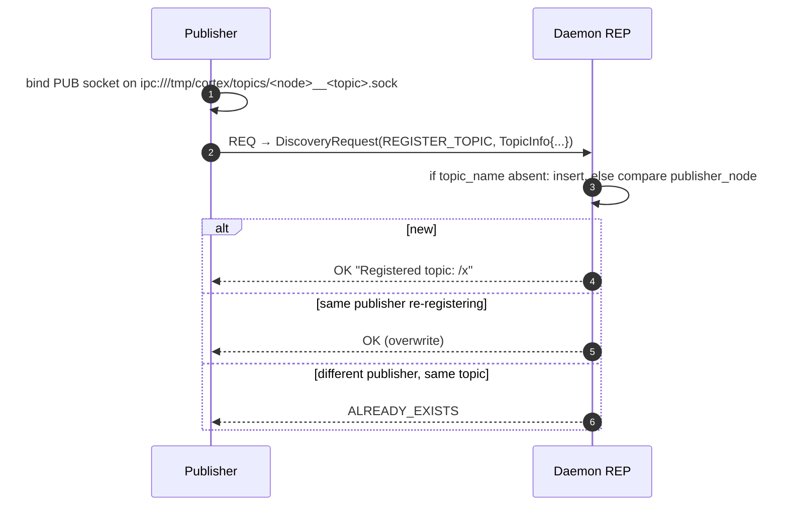
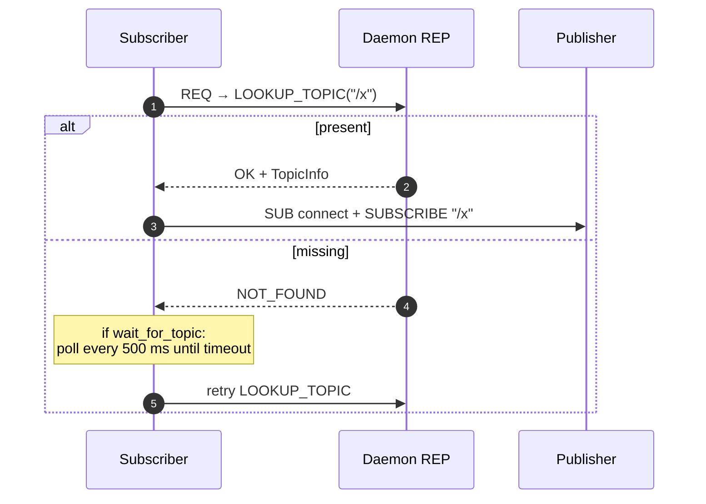
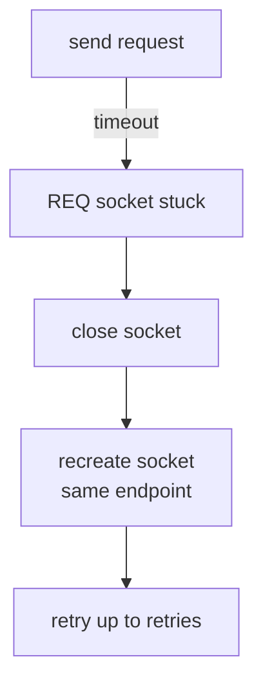

# Discovery protocol

A msgpack-over-REQ/REP protocol. Not on the data path — once a subscriber has the endpoint, messages flow publisher → subscriber directly.

## Commands

| Command                        | Payload required         | Returns            |
| ------------------------------ | ------------------------ | ------------------ |
| `REGISTER_TOPIC` (1)           | [`TopicInfo`][cortex.discovery.protocol.TopicInfo]               | OK / ALREADY_EXISTS |
| `UNREGISTER_TOPIC` (2)         | `topic_name` or `TopicInfo.name` | OK / NOT_FOUND     |
| `LOOKUP_TOPIC` (3)             | `topic_name`             | OK + `TopicInfo` / NOT_FOUND |
| `LIST_TOPICS` (4)              | —                        | OK + `list[TopicInfo]` |
| `SHUTDOWN` (99)                | —                        | OK; daemon exits   |

Status codes: `OK=0`, `NOT_FOUND=1`, `ALREADY_EXISTS=2`, `ERROR=3`.

## `TopicInfo` payload

```python
@dataclass
class TopicInfo:
    name: str              # "/camera/image"
    address: str           # "ipc:///tmp/cortex/topics/cam__camera_image.sock"
    message_type: str      # "ImageMessage"
    fingerprint: int       # 64-bit class fingerprint
    publisher_node: str    # "cam"
```

## Publisher register flow



## Subscriber lookup flow



`wait_for_topic_async` runs the retry loop with `asyncio.sleep` so the event loop keeps spinning.

## REQ-socket recovery

A ZMQ `REQ` socket gets stuck after a missed reply. The client detects `zmq.Again` on timeout and rebuilds the socket:



See [`DiscoveryClient._reconnect`][cortex.discovery.client.DiscoveryClient].

!!! bug "Fencepost in `retries` default"
    `retries=1` today executes the loop exactly once — i.e. no retry. Bump to
    `retries=3` in client-side code if you need resilience.

## Failure modes & how Cortex handles them

| Scenario                                 | Behavior                                      |
| ---------------------------------------- | --------------------------------------------- |
| Daemon not running when publisher starts | Register fails; publisher still publishes, but no subscriber can find it. |
| Daemon restarts                          | All state lost; publishers must re-register. Current design has no auto-re-register. |
| Publisher crashes                        | Registry keeps stale `TopicInfo` until someone UNREGISTERs. |
| Two publishers, same topic               | Second registration rejected with `ALREADY_EXISTS`. |
| Subscriber looks up before publisher     | `NOT_FOUND`; caller may `wait_for_topic` to poll. |

## See also

- [`cortex.discovery.protocol`](../reference/discovery/protocol.md)
- [`cortex.discovery.client`](../reference/discovery/client.md)
- [`cortex.discovery.daemon`](../reference/discovery/daemon.md)
- [Components → Discovery](../components/discovery.md)
