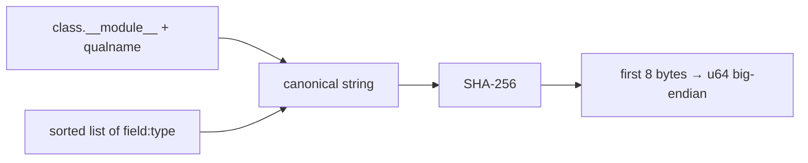
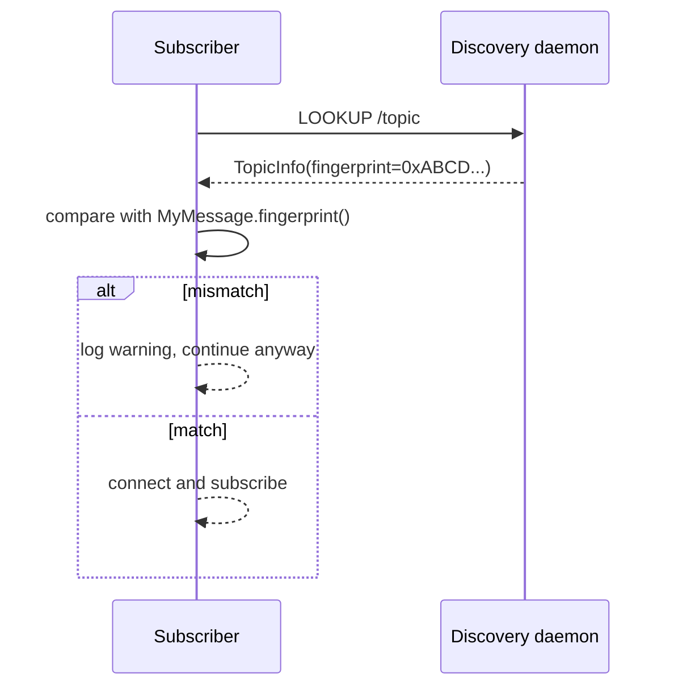

# Fingerprinting

Every message class has a 64-bit identifier derived from its name + field schema. The fingerprint rides in every message header and does two jobs:

1. **Type dispatch** — `Message.decode(bytes)` looks up the class in [`MessageType`][cortex.messages.base.MessageType].
2. **Compatibility check** — subscribers verify the topic advertises the same fingerprint as their compiled-against type.

## Derivation



Pseudocode:

```python
canonical = f"{cls.__module__}.{cls.__qualname__}|{','.join(sorted('name:type'))}"
fingerprint = int.from_bytes(sha256(canonical.encode()).digest()[:8], "big")
```

Cached per-class in `_fingerprint_cache`, computed once lazily.

## Registry

`Message.__init_subclass__` auto-registers every concrete subclass into [`MessageType._registry`][cortex.messages.base.MessageType] keyed by fingerprint. `@dataclass` + inherit from `Message` is enough.

```python
from dataclasses import dataclass
from cortex.messages.base import Message

@dataclass
class JointState(Message):
    positions: list[float]
    velocities: list[float]

print(hex(JointState.fingerprint()))
```

## When fingerprints change

Not stable across:

- Module path or class name.
- Field names.
- Field *type annotations as spelled* (see PEP 563 caveat below).

Stable across:

- Adding/removing unrelated classes.
- Reordering methods.
- Docstring or default-value changes.

## Subscriber check

On connect, the subscriber compares the topic's advertised fingerprint against the one it computes from its message class:



!!! warning "Mismatch is a warning, not an error"
    A fingerprint mismatch on the async subscriber path logs a warning and continues; decoding will likely fail afterward. Sync subscribers (`mode='sync'`) raise on mismatch. To get the strict behavior on async subscribers, pass `strict_fingerprint=True`.

## PEP 563 caveat

`field.type` may be a **string** (under `from __future__ import annotations`) or a **real type** otherwise. The canonical string differs in the two cases, so the same class can fingerprint differently across import environments. Use the same import style on both sides.

## See also

- [`cortex.utils.hashing`](../reference/utils/hashing.md) — `compute_fingerprint`, cache helpers
- [Message wire format](message-wire-format.md)
