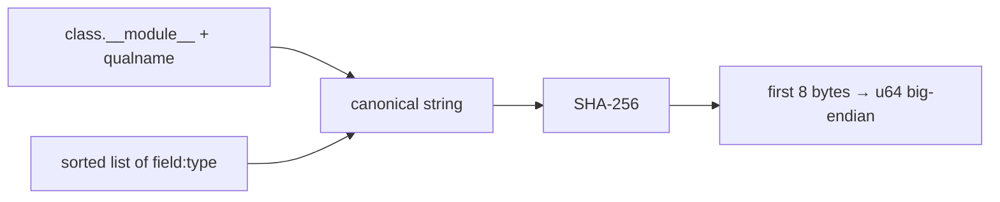
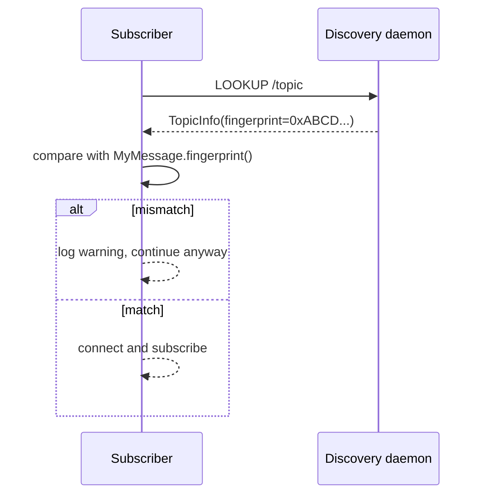

# Fingerprinting

Every message class gets a **64-bit identifier** derived from its name and
field schema. The fingerprint rides in the header of every published message
and does two jobs:

1. **Type dispatch** — `Message.decode(bytes)` looks up the right class in the
   [`MessageType`][cortex.messages.base.MessageType] registry.
2. **Compatibility check** — subscribers verify that the topic they looked up
   advertises the same fingerprint as the type they were written against.

## Derivation



Pseudocode:

```python
canonical = f"{cls.__module__}.{cls.__qualname__}|{','.join(sorted('name:type'))}"
fingerprint = int.from_bytes(sha256(canonical.encode()).digest()[:8], "big")
```

The result is cached per-class in `_fingerprint_cache`, computed once lazily.

## Registry

`Message.__init_subclass__` auto-registers every concrete subclass into
[`MessageType._registry`][cortex.messages.base.MessageType] keyed by
fingerprint. Nothing else to do — decorating your dataclass with
`@dataclass` and inheriting from `Message` is enough.

```python
from dataclasses import dataclass
from cortex.messages.base import Message

@dataclass
class JointState(Message):
    positions: list[float]
    velocities: list[float]

print(hex(JointState.fingerprint()))
```

## When fingerprints change

The fingerprint is **not stable across edits that touch**:

- Module path or class name (`cortex.messages.standard.ArrayMessage` renamed
  anywhere).
- Field names.
- Field *type annotations as spelled* (see the PEP 563 caveat below).

It is stable across:

- Adding/removing unrelated classes.
- Reordering methods.
- Changing docstrings or default values.

## Subscriber check

On connect, the subscriber compares the topic's advertised fingerprint against
the one it computed from its message class:



!!! warning "Today: mismatch is a warning, not an error"
    A fingerprint mismatch currently only logs a warning — see [critique.md](../critique.md).
    Downstream decoding will fail hard. Until that is tightened, prefer to
    re-exchange type definitions between processes rather than rely on this guard.

## PEP 563 caveat

`field.type` may be a **string** (under `from __future__ import annotations`)
or a **real type** otherwise. The canonical string differs in the two cases,
so the same class can fingerprint differently across import environments.

When defining messages shared between processes, either use the same import
style in both, or rely on the runtime `typing.get_type_hints(cls)` equivalent
once that lands upstream.

## See also

- [`cortex.utils.hashing`](../reference/utils/hashing.md) — `compute_fingerprint`, cache helpers
- [Message wire format](message-wire-format.md)
- [Critique § code-level issue 13](../critique.md)
