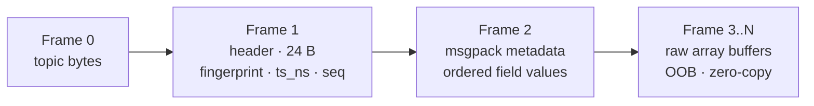

# Message wire format

Cortex uses **ZeroMQ multipart messages**. Each publish is a list of frames, not a single blob — array payloads ride as raw contiguous buffers (zero copy on send and receive).

## Frames on the wire



| Frame   | Contents                     | Size         |
| ------- | ---------------------------- | ------------ |
| 0       | Topic name (UTF-8) — prepended by `Publisher`, not part of `Message.to_frames()` | variable |
| 1       | [`MessageHeader`][cortex.messages.base.MessageHeader] | **24 bytes** (3 × u64, big-endian) |
| 2       | msgpack-packed ordered field values; arrays replaced by OOB descriptors | small        |
| 3..N    | `np.ndarray.tobytes()` / `tensor.numpy().tobytes()`, contiguous | payload-sized |

`Message.to_frames()` returns frames 1..N (header + metadata + OOB). The Publisher prepends Frame 0 for ZMQ's SUB topic filter.

## Header layout

```
offset 0        8       16       24
       |fp u64 |ts u64 |seq u64 |
        big-endian throughout
```

- `fp` — 64-bit message fingerprint, computed from class name + field schema.
- `ts` — publisher wall-clock in nanoseconds (`time.time_ns()`).
- `seq` — per-process, per-message-type monotonic counter.

## Metadata (Frame 2)

Field values are packed **in declaration order** (not by name); the receiver reconstructs using the dataclass's cached field tuple. Skips per-message field-name encoding.

Arrays and tensors appear as small **OOB descriptors**:

```json
{
  "__cortex_oob__": "numpy",
  "buffer": 0,
  "dtype": "<f4",
  "shape": [480, 640, 3]
}
```

`buffer` is the index into Frames 3..N. The receiver reconstructs:

```python
np.frombuffer(frame.buffer, dtype=np.dtype(desc["dtype"])).reshape(desc["shape"])
```

No copy. The array **aliases the ZMQ frame memory** — copy it if you need ownership or mutability (see [Performance tuning](../guides/performance-tuning.md)).

## Encode flow

```mermaid
sequenceDiagram
    participant U as User
    participant M as Message.to_frames
    participant S as serialize_message_frames
    participant E as _encode_transport_value
    participant Z as ZMQ send_multipart

    U->>M: build header + collect field values
    M->>S: values in declaration order
    S->>E: for each value, walk nested dicts/lists
    E-->>S: scalar stays inline; array → OOB descriptor + buffer appended
    S-->>M: returns metadata_bytes plus buf0, buf1, ...
    M-->>Z: Publisher sends topic, header, metadata, then each buffer
```

## Legacy single-blob path

`Message.to_bytes()` / `from_bytes()` / `Message.decode()` still exist. They pack everything into one msgpack blob using `ExtType` for arrays. Used by tests and ad-hoc serialization; the transport always uses multipart.

!!! warning "Mismatch trap"
    Bytes captured from the wire cannot be fed to `Message.decode()` — the wire format is multipart, not a single blob. Use `Message.from_frames(frames)`.

## See also

- [Fingerprinting](fingerprinting.md)
- [`cortex.utils.serialization`](../reference/utils/serialization.md)
- [`cortex.messages.base`](../reference/messages/base.md)
