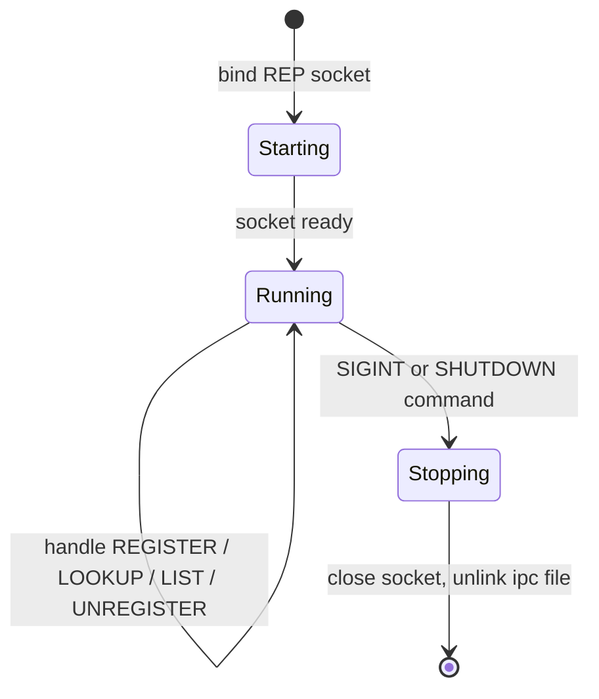

# Discovery daemon

A REP service maintaining the registry of active topics. Publishers register on startup; subscribers look up the endpoint and connect directly.

## Start

=== "Script"

    ```bash
    cortex-discovery
    ```

=== "Module"

    ```bash
    python -m cortex.discovery.daemon
    ```

=== "systemd"

    ```ini title="/etc/systemd/system/cortex-discovery.service"
    [Unit]
    Description=Cortex discovery daemon
    After=network.target

    [Service]
    Type=simple
    ExecStart=/usr/bin/env cortex-discovery
    Restart=on-failure
    RuntimeDirectory=cortex

    [Install]
    WantedBy=multi-user.target
    ```

## Flags

| Flag          | Default                                | Description                     |
| ------------- | -------------------------------------- | ------------------------------- |
| `--address`   | `ipc:///tmp/cortex/discovery.sock`     | ZMQ endpoint to bind            |
| `--log-level` | `INFO`                                 | `DEBUG` / `INFO` / `WARNING` / `ERROR` |

## Lifecycle



## Troubleshooting

**"Address already in use"**
:   Another daemon or a stale socket file is holding the path. `rm /tmp/cortex/discovery.sock` and restart.

**Subscribers time out looking up topics**
:   Daemon not running, or the publisher failed to register. Run with `--log-level DEBUG` and watch for REGISTER / LOOKUP lines.

**Daemon crash leaves stale entries**
:   Entries are only removed on explicit UNREGISTER. A crashed publisher's topic stays in the registry pointing at a dead socket. Restarting the daemon clears all state.
