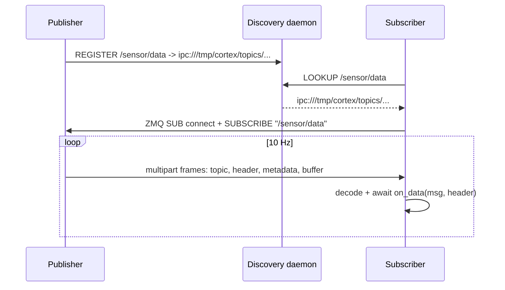

# Quickstart

A three-terminal pub/sub loop.

## 1. Discovery daemon

```bash
cortex-discovery
```

Leave it running. This is the service that maps topic names to IPC endpoints.

## 2. Publisher

```python title="pub.py"
import numpy as np
import cortex
from cortex import Node
from cortex.messages.standard import ArrayMessage


class SensorNode(Node):
    def __init__(self):
        super().__init__("sensor")
        self.pub = self.create_publisher("/sensor/data", ArrayMessage)
        self.count = 0
        self.create_timer(0.1, self.tick)  # 10 Hz

    async def tick(self):
        data = np.random.randn(64, 64).astype("float32")
        self.pub.publish(ArrayMessage(data=data, name=f"frame_{self.count}"))
        self.count += 1


async def main():
    node = SensorNode()
    try:
        await node.run()
    finally:
        await node.close()


if __name__ == "__main__":
    cortex.run(main())
```

```bash
python pub.py
```

## 3. Subscriber

```python title="sub.py"
import cortex
from cortex import Node
from cortex.messages.base import MessageHeader
from cortex.messages.standard import ArrayMessage


async def on_data(msg: ArrayMessage, header: MessageHeader):
    print(f"[{header.sequence}] {msg.name} shape={msg.data.shape}")


class ViewerNode(Node):
    def __init__(self):
        super().__init__("viewer")
        self.create_subscriber("/sensor/data", ArrayMessage, callback=on_data)


async def main():
    node = ViewerNode()
    try:
        await node.run()
    finally:
        await node.close()


if __name__ == "__main__":
    cortex.run(main())
```

```bash
python sub.py
```

## What happened



Next: [Concepts → Architecture](../concepts/architecture.md) or [Tutorials → Custom messages](../tutorials/custom-messages.md).
