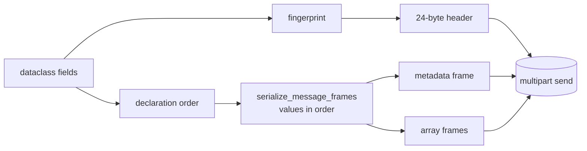

# Custom messages

A **message** in Cortex is any dataclass that inherits from
[`Message`][cortex.messages.base.Message]. Auto-registration, fingerprinting,
and (de)serialization are all derived from the dataclass definition — you
write the schema once, publishers and subscribers speak the same wire format.

## Define

```python title="messages.py"
from dataclasses import dataclass
import numpy as np
from cortex.messages.base import Message


@dataclass
class RobotState(Message):
    timestamp: float
    position: np.ndarray      # shape (3,)
    velocity: np.ndarray      # shape (3,)
    joint_angles: np.ndarray  # shape (N,)
    is_moving: bool
    frame_id: str = "base_link"
```

!!! tip "Shared module"
    Put your message definitions in a module **both** the publisher and
    subscriber import. The fingerprint is computed from
    `module.qualname` + field names/types; an identical re-declaration in
    two different modules produces **different** fingerprints.

## Publish

```python title="publisher.py"
import numpy as np
import cortex
from cortex import Node
from messages import RobotState


class StateBroadcaster(Node):
    def __init__(self):
        super().__init__("robot")
        self.pub = self.create_publisher("/robot/state", RobotState)
        self.create_timer(1 / 100, self.tick)  # 100 Hz
        self._t0 = 0.0

    async def tick(self):
        self._t0 += 0.01
        self.pub.publish(RobotState(
            timestamp=self._t0,
            position=np.array([self._t0, 0.0, 0.5], dtype="f4"),
            velocity=np.array([1.0, 0.0, 0.0], dtype="f4"),
            joint_angles=np.zeros(7, dtype="f4"),
            is_moving=True,
        ))


if __name__ == "__main__":
    cortex.run(StateBroadcaster().run())
```

## Subscribe

```python title="subscriber.py"
import cortex
from cortex import Node
from cortex.messages.base import MessageHeader
from messages import RobotState   # same import, same fingerprint


async def on_state(msg: RobotState, header: MessageHeader):
    if header.sequence % 100 == 0:
        print(f"t={msg.timestamp:.3f} pos={msg.position}")


class Monitor(Node):
    def __init__(self):
        super().__init__("monitor")
        self.create_subscriber("/robot/state", RobotState, callback=on_state)


if __name__ == "__main__":
    cortex.run(Monitor().run())
```

## How the dataclass becomes a wire message



See [Concepts → Message wire format](../concepts/message-wire-format.md) for
the full picture.

## Supported field types

| Field type                      | Notes                                                   |
| ------------------------------- | ------------------------------------------------------- |
| `int` / `float` / `bool` / `str`| Plain msgpack primitives                                |
| `bytes`                         | msgpack bin                                             |
| `list[...]` / `tuple[...]`      | Walked recursively                                      |
| `dict[str, Any]`                | Walked recursively; arrays inside are still OOB         |
| `np.ndarray`                    | OOB frame; zero-copy decode                             |
| `torch.Tensor`                  | OOB frame; CPU-transported, device restored on decode   |
| Optional nested `Message`       | Not first-class today — flatten instead                 |

## Evolution: what breaks the fingerprint

Changing any of these **changes the fingerprint** and makes old and new
publishers/subscribers incompatible:

- Renaming the class, its module, or any field
- Adding a field (even with a default)
- Removing a field
- Changing a field's annotation text

Safe to change without breaking:

- Reordering methods, adding methods
- Editing docstrings or defaults
- Changing unrelated classes in the same module

See [critique § 22](../critique.md) for the roadmap on first-class schema
evolution.

## See also

- [Concepts → Fingerprinting](../concepts/fingerprinting.md)
- [Components → Messages](../components/messages.md)
- [Tutorials → Multi-node system](multi-node-system.md) for custom messages used across multiple nodes
