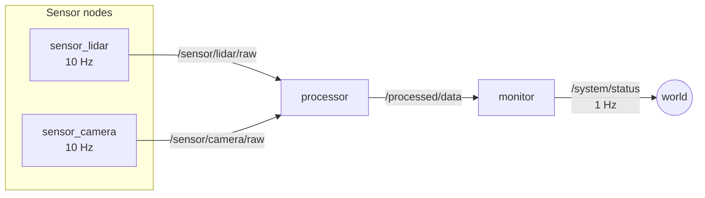
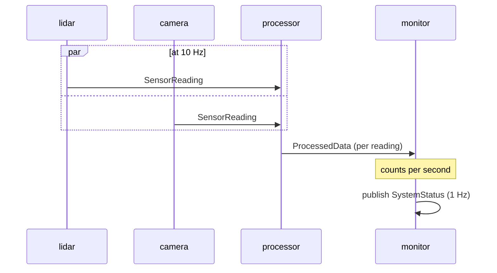

# Multi-node system

Walk-through of [`examples/multi_node_system.py`](https://github.com/sudoRicheek/cortex/blob/main/examples/multi_node_system.py) — a sensor → processor → monitor pipeline with custom messages and multiple pub/subs.

## Topology



Four nodes share one asyncio event loop via `asyncio.gather`. Cortex IPC works just as well between nodes in one process as between separate processes — data still rides ZMQ sockets either way.

## Message schema

Three dataclasses shared between every node so fingerprints match:

```python
@dataclass
class SensorReading(Message):
    sensor_id: str
    timestamp: float
    values: np.ndarray
    temperature: float

@dataclass
class ProcessedData(Message):
    source_sensor: str
    timestamp: float
    filtered_values: np.ndarray
    statistics: dict   # {mean, std, min, max}

@dataclass
class SystemStatus(Message):
    timestamp: float
    num_sensors: int
    processing_rate_hz: float
    total_messages: int
```

## Sensor node

```python
class SensorNode(Node):
    def __init__(self, sensor_id: str, publish_rate: float = 10.0):
        super().__init__(f"sensor_{sensor_id}")
        self.reading_pub = self.create_publisher(
            f"/sensor/{sensor_id}/raw", SensorReading
        )
        self.create_timer(1.0 / publish_rate, self._publish_reading)

    async def _publish_reading(self):
        t = time.time()
        values = np.sin(np.linspace(0, 2*np.pi, 100) + t) + 0.1*np.random.randn(100)
        self.reading_pub.publish(SensorReading(
            sensor_id=self.sensor_id,
            timestamp=t,
            values=values.astype("f4"),
            temperature=25.0 + 0.5*np.random.randn(),
        ))
```

## Processor

Subscribes to every sensor, filters, republishes:

```python
class ProcessorNode(Node):
    def __init__(self, sensor_ids: list[str]):
        super().__init__("processor")
        for sid in sensor_ids:
            self.create_subscriber(
                f"/sensor/{sid}/raw", SensorReading, callback=self._on_reading
            )
        self.processed_pub = self.create_publisher("/processed/data", ProcessedData)

    async def _on_reading(self, msg: SensorReading, header: MessageHeader):
        filtered = np.convolve(msg.values, np.ones(5) / 5, mode="same")
        self.processed_pub.publish(ProcessedData(
            source_sensor=msg.sensor_id,
            timestamp=msg.timestamp,
            filtered_values=filtered.astype("f4"),
            statistics={
                "mean": float(filtered.mean()),
                "std":  float(filtered.std()),
                "min":  float(filtered.min()),
                "max":  float(filtered.max()),
            },
        ))
```

## Monitor

Tracks throughput, emits status at 1 Hz:

```python
class MonitorNode(Node):
    def __init__(self):
        super().__init__("monitor")
        self.create_subscriber("/processed/data", ProcessedData, callback=self._on_processed)
        self.status_pub = self.create_publisher("/system/status", SystemStatus)
        self.create_timer(1.0, self._publish_status)
```

## Run the graph

```python
async def main():
    sensor_nodes = [SensorNode(sid, publish_rate=10.0) for sid in ["lidar", "camera"]]
    processor_node = ProcessorNode(["lidar", "camera"])
    monitor_node = MonitorNode()
    all_nodes = [*sensor_nodes, processor_node, monitor_node]

    await asyncio.sleep(1.0)  # let topics register and subscribers connect

    try:
        await asyncio.gather(*[n.run() for n in all_nodes])
    finally:
        for n in all_nodes:
            await n.close()
```

## Timeline



## Run it

```bash
# terminal 1
cortex-discovery

# terminal 2
python examples/multi_node_system.py
```

Expected output:

```
[processor] Sensor lidar: mean=0.012, std=0.708
[processor] Sensor camera: mean=-0.034, std=0.711
[monitor] System status: 192 messages, 19.2 Hz processing rate
```

## See also

- [Tutorials → Custom messages](custom-messages.md)
- [Components → Publisher & Subscriber](../components/publisher-subscriber.md)
- [Components → Node & Executors](../components/node-and-executors.md)
