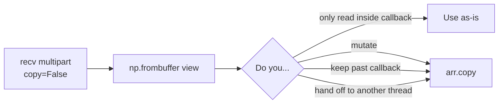

# NumPy arrays & images

NumPy arrays are first-class payloads. Array bytes travel as separate ZMQ frames and are reconstructed with `np.frombuffer` on the receiver — no intermediate `bytes`, no copy.

## Publisher

```python title="camera.py"
import numpy as np
import cortex
from cortex import Node
from cortex.messages.standard import ArrayMessage


class Camera(Node):
    def __init__(self):
        super().__init__("camera")
        self.pub = self.create_publisher("/cam/frame", ArrayMessage)
        self.create_timer(1 / 30, self.tick)  # 30 fps
        self._i = 0

    async def tick(self):
        frame = (np.random.rand(480, 640, 3) * 255).astype("uint8")
        self.pub.publish(ArrayMessage(data=frame, name=f"f{self._i}", frame_id="camera"))
        self._i += 1


cortex.run(Camera().run())
```

## Subscriber

```python title="viewer.py"
import cortex
from cortex import Node
from cortex.messages.base import MessageHeader
from cortex.messages.standard import ArrayMessage


async def on_frame(msg: ArrayMessage, header: MessageHeader):
    # msg.data aliases the ZMQ frame buffer — copy before mutating
    frame = msg.data.copy()
    frame[..., 0] = 0   # zero out red channel
    print(f"[{header.sequence}] {msg.name} mean={frame.mean():.1f}")


class Viewer(Node):
    def __init__(self):
        super().__init__("viewer")
        self.create_subscriber("/cam/frame", ArrayMessage, callback=on_frame)


cortex.run(Viewer().run())
```

## Aliasing rule



The view is valid for the lifetime of the ZMQ frame, which ends when the callback returns. Copy if you need ownership.

## `ImageMessage`

[`ImageMessage`][cortex.messages.standard.ImageMessage] adds an `encoding` string plus optional `width`/`height` (auto-filled from shape):

```python
from cortex.messages.standard import ImageMessage

msg = ImageMessage(data=frame, encoding="rgb8")  # width/height set in __post_init__
pub.publish(msg)
```

Encodings are free-form. Cortex doesn't validate or convert them.

## Cost

1080p RGB frame ≈ 6 MB. On the benchmark suite:

- Encode allocation: zero.
- Decode allocation: zero (array is a view into the ZMQ frame).
- Throughput: ~1400 fps on a modern workstation.

## See also

- [Concepts → Message wire format](../concepts/message-wire-format.md)
- [Components → Serialization](../components/serialization.md)
- [Guides → Performance tuning](../guides/performance-tuning.md)
