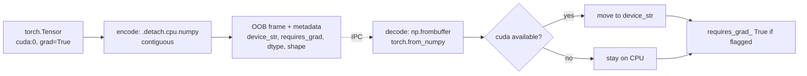

# PyTorch tensors

[`TensorMessage`][cortex.messages.standard.TensorMessage] pipes tensors between processes using the same zero-copy multipart transport as NumPy. Device and `requires_grad` are preserved; bytes travel via the CPU side.

## Publish

```python title="inference_producer.py"
import torch
import cortex
from cortex import Node
from cortex.messages.standard import TensorMessage


class Inference(Node):
    def __init__(self):
        super().__init__("inference")
        self.pub = self.create_publisher("/model/features", TensorMessage)
        self.create_timer(1 / 30, self.tick)

    async def tick(self):
        feats = torch.randn(4, 256, 7, 7, device="cuda" if torch.cuda.is_available() else "cpu")
        self.pub.publish(TensorMessage(data=feats, name="layer4_feats"))


cortex.run(Inference().run())
```

## Subscribe

```python title="downstream_consumer.py"
import cortex
from cortex import Node
from cortex.messages.base import MessageHeader
from cortex.messages.standard import TensorMessage


async def on_features(msg: TensorMessage, header: MessageHeader):
    t = msg.data
    print(f"{msg.name}: shape={tuple(t.shape)} device={t.device} grad={t.requires_grad}")


class Consumer(Node):
    def __init__(self):
        super().__init__("consumer")
        self.create_subscriber("/model/features", TensorMessage, callback=on_features)


cortex.run(Consumer().run())
```

## What's preserved



| Attribute            | Transported              |
| -------------------- | ------------------------ |
| `dtype`              | ✓ exact                  |
| `shape`              | ✓                        |
| `device`             | ✓ string; restored on decode if available |
| `requires_grad`      | ✓                        |
| `grad` (the gradient itself) | ✗ not sent       |
| autograd graph       | ✗ not sent (`detach()` is implicit) |

## Multi-tensor payloads

[`MultiTensorMessage`][cortex.messages.standard.MultiTensorMessage] carries several tensors at once. Each gets its own OOB frame; no bytes are copied into a container.

```python
from cortex.messages.standard import MultiTensorMessage

msg = MultiTensorMessage(tensors={
    "image": image_tensor,
    "features": feat_tensor,
    "logits": logit_tensor,
})
pub.publish(msg)
```

## Caveats

!!! warning "CPU detour is mandatory"
    Even for two processes on the same GPU, tensors are DMA'd to CPU on send and back to GPU on receive — one copy per side. Cortex does not support CUDA IPC. For tight in-process handoffs, use `torch.multiprocessing` or shared CUDA memory directly.

!!! note "Install with the `torch` extra"
    `TensorMessage` raises on construction if PyTorch is not installed. `pip install -e ".[torch]"`.

## See also

- [Concepts → Message wire format](../concepts/message-wire-format.md)
- [Components → Serialization](../components/serialization.md)
- [Tutorials → NumPy arrays & images](numpy-and-images.md)
